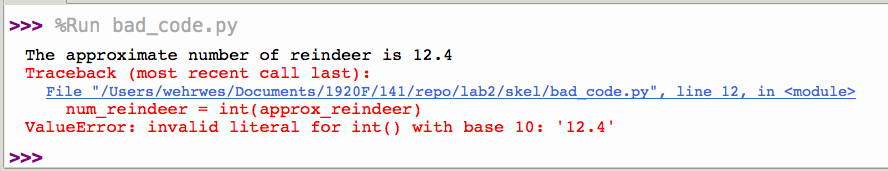

% CSCI 141 - Lab 2
% Caroline Hardin
% Fall 2024

**Note for next time: make them run on the terminal *and* in Thonny with cmd line arguments**

## Overview

This lab introduces you to the Linux command line, command line arguments, and explores errors, printing and operands. You should have enough time to complete this lab during the lab session. Upload your submission to Canvas before the deadline. If you have questions, be sure to ask the TA. Ask questions often. Labs are your opportunity to get personalized help!

## Logging into Linux

Linux is an operating system with much of the same functionality as the Windows or Mac operating systems, but with a slightly different feel. The lab computers you'll be using for this class have Linux on them. After they boot, you should be able to enter your username and password; the login prompt should look something like this:


To find Thonny, click the App icon (the bottom-most icon in the bar on the left side of the screen). If Thonny doesn’t appear among the applications there, you can type Thonny in the search bar and it should appear. Once Thonny starts, it should look very similar to the Windows version you used in last week’s lab.

## Linux Command Line Basics

Windows, Mac OS, and Linux all provide graphical interfaces such as those you're used to using, that allow you to open programs and accomplish tasks using the mouse, icons, windows, and so on. All of these operating systems also provide another way of interacting with them, called a *Command Line Interface* (CLI). Although there is a steeper learning curve for knowing how to accomplish things using the command line, for certain tasks it can be more powerful once you know how to use it.

In this lab, you will learn the very basic elements of how to interact with the Linux command line and learn how to run Python code without the help of an IDE such as Thonny. What you will learn here is only a tiny fraction of the commands available; you can find a helpful \"cheat sheet\" of many commonly used Linux commands [here](linuxref.pdf) if you'd like to learn more.

1. Begin by opening a command line window (also called a Terminal). Click on the App icon in the lower left corner and type terminal to initiate a search; click on the Terminal icon from the results to launch a new terminal window. You can also quickly open a terminal by presing Ctrl+Alt+T.

2. In the terminal, you'll see a **prompt** that ends with a `$` sign. This is called the command line, or command prompt; you'll type commands here to interact with the system. Commands that you issue are interpreted by a program called a shell. The default shell, or command line language on the lab machines  is called `bash`; it is one of the many shells available in Linux.

3. You’ll notice that the `$` is prepended with your username and an `@` followed by the name of the computer that you are logged into. For example, `lovelaceA@linux-11:~$` specifies the user `lovelaceA` logged into the `linux-11` machine.

4. Anything you can do with the mouse when interacting with a Windows environment you can also accomplish via the command line. In the following steps you will create a new directory (folder), navigate into that folder, and run a Python file, using only the command line. For these instructions, code and/or sample file content or output are displayed in code blocks like the one below. Type commands EXACTLY as they provided, and press return/enter to issue the command. For example:

   ```
   whoami
   ```

   is instructing you to type the command `whoami` on the command line and execute it by pressing return/enter. Try it out. What does this command do?

5. Commands can take arguments, similarly to how functions in Python take arguments, except here they are not surrounded by parentheses. To create a directory, use the `mkdir` command with a single argument that is the name of the directory (folder) that you want to make. Create the directory `lab2`:

   ```
   mkdir lab2
   ```

6. To confirm that you have made your directory, issue the `ls` (lower case 'LS', stands for 'LiSt') command, which will list all contents of the directory where you are currently in.

   ```
   ls
   ```

   You should see a list with multiple items, which are the files and/or directories in your account. If done correctly, `lab2` should among the list.

7. In a graphical interface, you would double click on a folder to access that folder. On the linux command line, you enter a directory using the command `cd`, for `c`hange `d`irectory. Enter the `lab2` directory.

   ```
   cd lab2
   ```

8. Launch Thonny via the command line:

   ```
   thonny &
   ```

   The `&` is important: this allows you to continue using the terminal window AFTER you launch Thonny.

9. Use Thonny to create a new file called hello_world.py. Create a comment at the top stating author, date, and description, then type in the following code, replacing `Ada` with a name of your choice.

   ```python
   user_name = "Ada"
   print("Hello,", user_name)
   ```

   Save the file in your `lab2` folder. Return to the terminal, and again issue the `ls` command, and you should see the just-created file listed.

10. Just as you can run a Python program using Thonny by pressing the green Run button (and in repl.it using its friendly green Run button), you can also run a program from the command line. In the terminal window (make sure you are in your `lab2` folder, which contains your Python program), run the `hello_world.py` program by invoking the python interpreter:

    ```
    python3 hello_world.py
    ```

    You should see the output of your program printed out to the terminal.

## Command Line Arguments (aka System or Program Arguments)

We've seen how to ask the program's user to provide input using the `input` function, which returns a value of type `str` containing whatever the user entered. In this section, we'll see another way to get input from a user by having our program take *command line arguments*. Much like how the `mkdir` shell command takes an argument specifying the name of the directory you want to create, Python programs can also read arguments that are specified on the command line when they are run. We pass arguments to Python programs in the same way.

1. Try running the following:

   ```
   python3 hello_world.py DorothyVaughan
   ```

   Notice that the program runs just fine, but doesn't do anything differently from before - that's because our program currently ignores any command line arguments given to it.

2. In a few weeks we'll cover some more ways you can use command line arguments to add convenience to testing your code. For now, let's try just accessing them. try changing **your Python program's code** to the following:

       import sys
       user_name = sys.argv[1]
       print("Hello,", user_name)

   This syntax means you want the item in index 1 on the **sys** module's list of **ARG**ument **V**alues. Notice that we had to `import` the sys module - it's not part of the default Python distribution. There are many powerful and exciting modules you can add to Python - we'll learn about more of them later in the class! Thonny comes with these extra modules bundled; if you are using a different IDE and you get an error that it cannot find Sys, you may need to use pip to install Sys or update your environment 'Path' variable. 

3. Remember that when running a program from the command line, we're not in Python, and here arguments are specified without parentheses or commas. To run your updated program, try the same command as before in the terminal:

   ```
   python3 hello_world.py DorothyVaughan
   ```

   **A helpful command line tip:** If you want to run the same command again, you can press the up arrow key to get the last command run to show up at the prompt; to run it again, simply press enter. You can also press the up arrow multiple times to scroll back through the history of all the commands you've run.

   Try the same command but replace DorthyVaughan with a name of your choice - you should see that your program is printing whatever name you specify on the command line.

4. What happens if you run your program without providing a command line argument? Try running this:

   ```
   python3 hello_world.py
   ```

   Python throws an error (Index Error: list index out of range) because we're asking for an argument that wasn't provided.

5. If more than one argument is given, you may be able to guess how we access it: `sys.argv[2]` refers to the second argument specified, `sys.argv[3]` for the third, and so on. Try changing your program to say hello to two people:

       import sys
       name1 = sys.argv[1]
       name2 = sys.argv[2]
       print("Hello,", name1, "and", name2)

   Then run your program with something like:

   ```
   python3 hello_world.py Caroline Scott
   ```

   Command line arguments are a little less flexible than using the `input` function because the program can't interactively ask the user for inputs. However, it can be much more convenient to take input this way, especially when you're running a program over and over again while testing it: you can simply repeat the same command without having to type the input again.

6. A final question that we need to answer: we've seen how to provide command line arguments when running a Python program from the terminal, but how can we accomplish the same thing in Thonny, where we run a program by simply pressing the green Run button?

   Thonny lets you specify arguments to the program in a text box at the top of the window, labeled \"Program Arguments\". If you don't see it, you can enable it under the 'View' menu. To run the equivalent of

   ```
   python3 hello_world.py Scott Perry
   ```

   in Thonny, type `Scott Perry` into the Program arguments box at the top, then press the green Run button. You should see something like this:

   {height="2.5in"}
   
   For the remaining sections of this lab, you can run Python either via Thonny or via the command line.

## Comments, fancy printing, and debugging

Inevitably, you will write code that will have bugs, or errors, no matter how experienced of a programmer you might be. Knowing how to find and fix bugs is a critical skill for all programmers.

Download [bad_code.py](bad_code.py) (right click the link and select "Save link as..." or left click on it then click the 'Download raw file' button) and save it in your lab2 folder.

#### Commenting Code

Open `bad_code.py` in Thonny. Read over the code, paying particular attention to the comments. Proper commenting is crucial to writing good code, so that it is easy to read by you and others. In python all comments begin with the `#` character. As a general rule:

-   Include your name (the author) and a short description at the top of each .py file

-   For every few lines of code, include a descriptive comment

-   Use white space (blank lines) to chunk your code into logical sections

This code has a bug and won't work, but it is a good example of commenting your code. For all the labs and assignments in this course, commenting is a portion of the rubric. Get into the habit now of commenting your code well! Not only is it helpful to you, it's a required part of each lab and assignment.

#### Using `print` with `sep` and `end`

Notice that this code uses the `sep` keyword argument to the `print` function. Recall from lecture that adding `sep=""` (short for "separator") after the rest of the regular arguments prevent print from adding spaces between items that you want printed. If you use `sep=""`, the only spaces that are included in the output are the spaces that you place explicitly into the Strings. For example:

    print("Taking", "CSCI", 141, "woo-hoo!")

prints the following:

    Taking CSCI 141 woo-hoo!

but

    print("Taking", "CSCI", 141, "woo-hoo!", sep="")

would print the following:

    TakingCSCI141woo-hoo!

Recall that the `print` function defaults to `" "` as the separator between the arguments it prints. If you want a different separator, you can give any string to the `sep` argument, such as the empty string (`sep=""`) or a comma (`sep=","`), or any other string you'd like (e.g., `sep=", uhh, "`). Try out a few calls to `print` with different separators in the interactive Shell pane in Thonny.

Once you have a feel for the usage of `sep`, play around with the `end` keyword argument, which specifies what gets printed after all the arguments are printed and defaults to `\n`, the newline character, which moves the "cursor" to the beginning of the next line so anything printed afterwards appears on the next line.

Try running a few `print` commands with `end` specified to get a feel for its behavior.

#### Debugging

More often than not, a program doesn't work the way I want the first time I write it. You may find that you have a similar experience, so it's very useful to get familiar with how Python behaves when something goes wrong. `bad_code.py` has a **single** intentional error. If you run the code, you should see something like this:

{height="1.0in"} []{#fig:thonny label="fig:thonny"}

Look closely at the error message - it tells you on what line number to look for the error. Fix the bug (**Hint:** review the lecture slides on data type conversion functions such as `int`). You should only need to modify the line of code that says `num_reindeer = int(approx_reindeer)`. Do not not modify any other line of code, add additional code, or delete any line of code.

## More Debugging

Download [faulty_code.py](faulty_code.py) (right click the link and select "Save as...") and save it in your lab2 folder. Take a close look at the code. Notice again the good commenting style. Unfortunately, `faulty_code.py` has multiple errors. Run the code and look closely at the error message. Determine the cause of the error, fix it, and try running the code again. Repeat this process until the program runs without error and the output of the program matches the following:

{#fig:correct width="0.7\\linewidth"}

## Operands and Operators

In lecture we have discussed operands and operators. Make sure that you know the definition of both. If you do not recall, review the lecture slides.

In this section, you'll solve the following programming problem: **The period key on your keyboard is broken, but you would like to multiply two numbers with a decimal digit.**

Let's look at an example. Suppose you want to calculate $20.4 \times 17.7$, but can only enter $204$ and $177$. The desired result is $361.08$. If the user inputs the values 204 and 177, how can you convert them to 20.4 and 17.7? By using the modular and integer division operators! For example, 204 modulus 10 has a remainder of 4, which gives the decimal value .4, while 204 integer division 10 gives 20, which is the number before the decimal in 20.4.

**The Math:** Suppose that for the input values 204 and 177 you have successfully extracted the whole and decimal values (i.e., 20, 4, 17 and 7). How can you calculate the result of 20.4 x 17.7? Multiplication of decimal values requires you to sum the following four parts:

-   The first integer times the second integer

-   The first integer times the second decimal

-   The first decimal times the second integer

-   The first decimal times the second decimal

Notice that for each decimal, we also multiply in a factor of 0.1 to make sure that it is correctly weighted in the final product. In our example, the calculation looks like this: 
$$
\begin{align}
20.4 * 17.7 &=  (20*17)\\
              &+  (20 * 7 * 0.1)\\
              &+  (4 * 0.1 * 17)\\
              &+  (4 * 0.1 * 7 * 0.1)\\
              &=  340 + 14 + 6.8 + 0.28\\
              &= 361.08 
\end{align}
$$

1.  Download [broken_calculator.py](broken_calculator.py)  and save it to your Lab2 folder.

2.  That file is incomplete. Only two lines of code have been written, labled *#DO NOT CHANGE THIS LINE *: Do not edit these lines! The rest are comments. Lines of code that say `# TODO: COMPLETE THE CODE` you will need to write. Read the comments for each section to get a sense of what code you need to write. Also, the number of COMPLETE THE CODE comments in that file is how many lines of python code I (your professor) wrote in my solution. It's okay if your solution uses fewer lines of code, or more, but each block of code should accomplish what the comment above it specifies.

    **For the lines of code that you write, you are only allowed to use the `print` function, the assignment operator, and the following mathematical operators:**

    -   `//`

    -   `%`

    -   `*`

    -   $+$

    **For the lines of code that you write, you cannot use `float()`, nor `int()`, nor `/`.**

3.  There are 7 parts to the code, labeled A through G. Here are hints for each of them:

    -   **A:** This requires a single use of the print function

    -   **B:** Use only the `//` and `%` operators. Follow the logic in the description above

    -   **C:** This requires a single use of the print function

    -   **D:** Do the same for the second integer as you did for the first integer (step B). Use only the `//` and `%`operators

    -   **E:** The same as step C, but for the second integer

    -   **F:** Use the Hint above for explanation on how to do this

    -   **G:** This requires a single use of the print function.

**In your Python code, you CAN make use of periods, but when the program is RUN, the user CAN ONLY enter integer (non decimal) numbers.**

Here's a sample run of the completed code:


# Submission {#submission .unnumbered}

Upload the following files to Canvas:

-   Your fixed `bad_code.py` file

-   Your fixed `faulty_code.py` code file

-   The completed `broken_calculator.py` file that can reproduce the output shown in the above figure

Double check that you've not changed the file names!

# Rubric {#rubric .unnumbered}

This lab is graded out of a total of 15 points:

* 3 points: `bad_code` has been fixed and is properly commented

* 3 points: `faulty_code.py` has been fixed and is properly commented
* 3 points: `broken_calculator.py` uses **only** `%`, `//`, $+$ and $*$ operators for the lines of code that you have written 
* 3 points: `broken_calculator.py` produces the correct output
* 3 points: `broken_calculator.py` is properly commented
