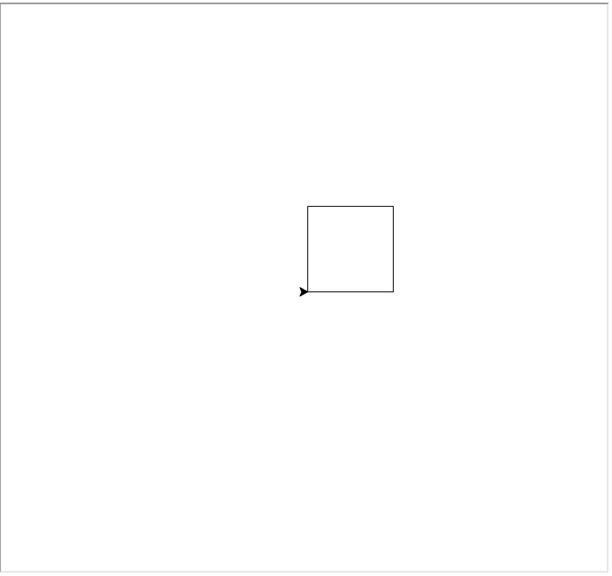
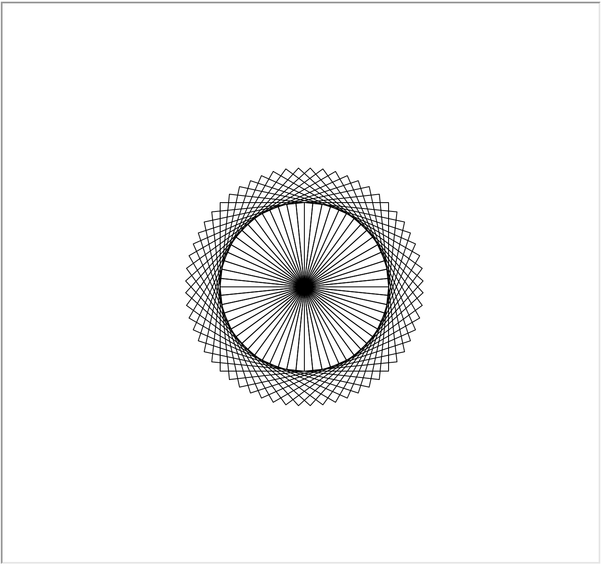
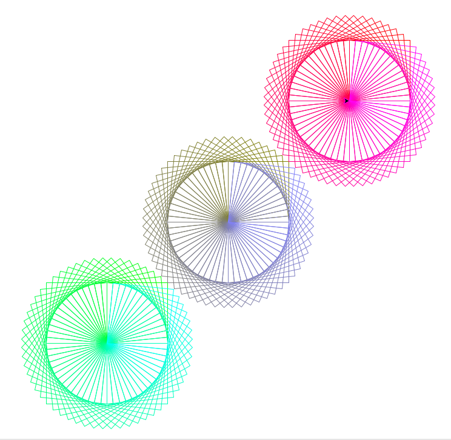

% CSCI 141 - Lab 4
% Dr. Hardin
% Fall 2024

## Introduction and Setup 

This lab gives you practice with Python loops and Turtle graphics. You'll complete two programs that draw pictures: the first uses so-called "ASCII art", which refers to pictures made from text characters; the second one is made using a turtle. If you have questions, be sure to ask the TA: your TA is there to help you! You will write two programs: `triangle.py` and `turtledraw.py`.

## 1. `triangle.py`

Your first task is to write a program which prints a sideways isosceles triangle made of asterisks ("`*`") with a maximum width specified by the user via a command line argument. For example, a width of 3 would print:

``` {samepage="true"}
*
**
***
**
*
```

A width of 8 would print:

``` {samepage="true"}
*
**
***
****
*****
******
*******
********
*******
******
*****
****
***
**
*
```

A triangle of width 1 would print a single asterisk, and width 0 should print no asterisks.

Your solution should use at least one `for` loop. Here's a suggested way to approach this problem:

1.  Create an empty file `triangle.py` in your lab4 directory. Write a comment at the top listing the code's author, date and a short description of the program.

2.  Get the width of the triangle from the system arguments.

3.  Write a code snippet that prints a given number of asterisks in a row, followed by a newline. *Hint:* there are ways to do this with or without using a loop!

4.  Draw the top half of the triangle by putting the code you wrote in Step 2 in the body of a loop that changes the number of asterisks drawn.

5.  Draw the bottom half of the triangle using a similar approach.

6.  Test your code on widths 2 and 3 first, then check 0 and 1, then try a larger number such as 8.

## 2. `turtledraw.py`

In this section, you'll write a program `turtledraw.py` that creates a picture like the one shown below. This may seem intimidating at first! But the code you'll need to write isn't actually that complicated. There's a lot of repetition in the picture, and you'll use loops to perform this repetition effortlessly.

You'll also get some practice looking at the documentation for a module; the `turtle` module has tons of functionality, most of which you won't use or understand---that's fine! The ability to sift through unfamiliar documentation and find out how to use the pieces relevant to solving your problem is a valuable skill.

{#fig:turtleflake width="50%"}

Each pattern is identical, and is simply composed of many squares with side length 100, each drawn with one corner in the center of the pattern, but at different angles.

### Drawing a Square

Start by writing code to draw a square with side length 100. Recall that you saw an example like this in lecture videos - you may want to download `turtle_square.py` from the course materials linked to from the topic schedule as starting point. After this step, your program should generate the following picture:

{#fig:turtlesquare width="50%"}

### Drawing one pattern with many squares

Next, you'll create a single one of the patterns. To draw 60 squares that go all the way around a circle (360 degrees), you'll need each one to be different by 6 degrees from the previous one. Put the code for drawing a square inside a `for` loop that draws all 60 squares, turning by 6 degrees between squares. When it works correctly, you should get a picture like the  following:

{#fig:turtleflake width="50%"}

### Speeding up the drawing

At this point, you're probably sitting around waiting for the turtle to finish drawing, and thinking "wow, CS is boring". Most programs we write run very quickly, but you can see that loops make it easy to write short programs that still take a long time to finish! Fortunately, the `turtle` module has some features to speed up the drawing. Start by looking in the `turtle` module's documentation (<https://docs.python.org/3.3/library/turtle.html>). There's a lot there, but don't worry about all the stuff you don't understand! Find the section on the `speed` method, and read the description to see if you can figure out how it's used. In your code above where your turtle starts drawing anything, call the `speed` method on your turtle object (e.g., `scott.speed(`*`arg`*`)`) with the correct argument to make the turtle move as quickly as possible. Try running your program again - do the squares draw faster now?

That helps some, but it still takes a few seconds to draw 60 squares! The reason for this is that Python is re-drawing the entire picture every time the turtle moves. You can think of this as Python having to loop over all 120,000 pixels and re-color each one.

We can speed things up even more by telling the turtle module (which controls all the turtles) not to re-draw whatever all the turtle objects are doing between moves, and to draw once at the end. Near the top of your code, before your turtle starts drawing, add the following line:

```python
  turtle.tracer(0, 0)
```

This tells Python "don't re-draw the screen until I tell you to." Next, at the end of your program, add the following line:

```python
  turtle.update()
```

This is how you tell Python to re-draw the screen. **Notice** that these are both `turtle` module functions, not methods of your turtle object. Now we're not wasting effort re-drawing each time the turtle moves! When debugging your code, you may find it helpful to turn the animations back on to see the sequence of moves the turtle makes. Make sure that the submitted version of your code, however, has the above lines and draws the whole picture in less than a couple seconds.

Finally, after `turtle.update()`, add the following line:

```python
turtle.done()
```

This line should have no visible effect if you're running from Thonny, but it prevents the turtle window from closing immediately when running the program from the command line; this makes grading much easier for your TA.

### Repeating the pattern three times

The last thing we need to do is draw the pattern three times, near each corner of the window. In particular, one at coordinates (-200, -200), the next in the middle of the screen (at coordinates (0, 0), where the turtle starts), and the last one at (200, 200) in the upper right hand corner. Start by looking at the documentation for the `penup`, `pendown`, and `goto` methods. Start by using these methods to move your turtle to position (-200, -200) before drawing the pattern. Make sure the turtle doesn't draw a line when it's moving from the middle of the screen to the corner.

Finally, we need to move the turtle to each of the 3 positions and repeat the same pattern. You could copy/paste the same code three times and change the coordinates, but that wouldn't be ideal if we wanted to draw lots more of these patterns instead. So let's use loops instead!

The coordinates where we want to draw the pattern are:

      (-200, -200)
      (   0,    0)
      ( 200,  200)

Notice that each coordinate increases by 200 each time it runs. Since you know exactly how many times this will run, a for loop will be easier to use than a while loop. The pseudocode I’d write for this is something like:

```python
set x and y to -200
do 3 times:
  move to x, y
  draw the pattern
  increase x and y by 200 each
```


## Color the drawing

Look up the turtle's `color` method and figure out how to make your drawing more colorful. You can color the drawing however you want (it could be as simple as making each pattern a different color), but **don't** change the pattern drawn. An example coloring is shown here:

{#fig:turtleflake width="50%"}

## Submission

Submit `triangle.py`and `turtledraw.py` to the Lab 4 assignment on Canvas.

## Rubric

This lab is graded out of 10 points:

* 3 points:  `triangle.py` produces the correct output
* 2.5 points: `turtledraw.py` draws at least one instance of the pattern
* 2.5 points: `turtledraw.py` draws three copies of the pattern in the correct corner positions using loops
* 2 points: `turtledraw.py` draws the pattern quickly and without animation and includes `turtle.done()` as the last line.     

Deductions may be made for style issues. Make sure your program adheres to the following good coding practices:

* The top of each program has comments including your name, date, and a short description of the program's purpose
* Variables are named well and explanatory comments are included as needed
