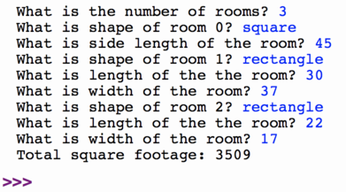
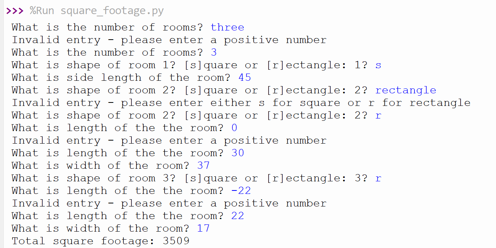

% CSCI 141 - Lab 6
% Caroline Hardin
% Fall 2024

## Introduction

By this time in the quarter you've seen functions in lecture, in lab, and from here on you will see them in most of the programs of the day.

In this lab, you'll write a program that calculates the total square footage in a home. Imagine you are working for a construction company that builds homes with only square or rectangular rooms. The houses vary in size, with as little as 1 room and up to 100s. **Your task is to write a program that will prompt the user to input the number of rooms and their dimensions, and which then calculates the total square footage of the home**. Two invocations of such a program are shown below.

 
In the first example, a user specifies a house with 3 rooms -- a square room and two rectangle rooms, and makes no errors in their input. 

The second shows a calculation for a house with 4 rooms -- three square rooms and a rectangular room, and the user makes some errors in their input.

You'll create such a program mostly from scratch, following good coding style.

In the program invocations above, notice the following:

-   To calculate the size of a square room, you need only the dimension of one of the walls

-   To calculate the size of a rectangular room, you need both dimensions, the width and length

-   There are repeated print statements that are very similar, but not identical. However, they all begin with "What is ", and end with a question mark.

- The user may enter invalid data, so if they do so they should be advised of their mistake and asked to enter the data again. If we did not do this, one user typo could cause the program to crash and lose all progress.

From these observations, your supervisor has decided that your program can have ONLY 3 functions:

1.  `room_square_feet`, which takes a single argument to designate whether the room is a square or rectangular room. If the room is a square room, the function `room_square_feet` invokes the `prompt_user` function once to retrieve the single dimension needed to calculate the size of the room. If the room is a rectangular room, the function `room_square_feet` invokes the `prompt_user` function twice to retrieve the two dimensions needed to calculate the room's size. The function `room_square_feet` returns the square footage of a room.

2.  `main`, which prompts the user for the count of rooms and calls `room_square_feet` for each room, using the accumulator pattern (refer to Section 6.4 of the textbook) to keep a running total of the square footage of the house.

3.  `prompt_user`, which receives two arguments and returns one value.
    * The first argument, of type `str`, is the text of the question that the user is prompted. In the example output above, prompt_user is called with the first argument set to `"length of the room"`, `"width of the room"` and `"shape of room 1, square or rectangle"` on different occasions.
    * The second argument designates the return type of the function. Since the user input always comes in as a string, you'll need to use type conversion function(s) to convert the user's input into the appropriate type of data to be returned. 
    * Since invalid input would cause the whole program to crash and the user to lose their work, this function also handles the work of checking if the user's input is valid. 
    
        * If they wanted an integer, they should be prompted repeatedly until they enter a digit which is greater than 0. (hint: Check out the String methods for some tools which will help here). 

        *If they wanted a string, the only valid responses are 's' or 'r'. Use string methods to change their input to lower case and strip out any leading or trailing white spaces.

## Setup

Create a `lab6` folder and in it create a Python file called `squarefootage.py`.

## Example Program Flow

The steps below illustrate an example of the program's behavior when prompting for the information and calculating the square footage of a single room. Recall that your main program will do this once for each room in the house. Notice that `main` uses `prompt_user` twice, then calls `room_square_feet`, which itself calls `prompt_user` once or twice depending on the shape of the room.

1.   `prompt_user` is invoked with first and second arguments "shape of room 1" and "string" both of type string.

2.   `prompt_user` prompts the user with the question "What is the shape of room 1?"

3.   The user responds to the prompt and types "square"

4.   `prompt_user` returns the string "square", which is then passed to the function `room_square_feet`

5.   The function `room_square_feet` calls `prompt_user` with two arguments, "side length of square room" and "integer"

6.   The function `prompt_user` prompts the user with the question "What is the side length of square room"

7.   The user responds to the prompt and types "12"

8.   The function `prompt_user` returns the integer 12, which is saved in a variable in the function `room_square_feet`

9.   The function `room_square_feet` calculates the size of the room ($12 * 12$) and returns the integer 144.

## Game Plan and Guidelines

-   If you weren't checking for user errors, all three functions are fairly simple taken by themselves. You should be able to write each one in less than about 10 lines of code. Adding the error checking to the prompt_user will add about10 lines of code to prompt_user.

-   Start by writing a header and specification for the `prompt_user` function based on the description above. Then implement the function and test it using the interactive shell. Test it for both integer and string output types. Begin by assuming the input is valid, then once everything is working, add in the error checking.

-   Write a header and specification for `room_square_feet`. Implement it, using your already-tested `prompt_user` function, and test its functionality in the interactive shell.

-   The `main` function has been started for you. Note that it takes no arguments and has no return value; when the total square footage is calculated, *print* the total.

-   Finally, at the bottom of your program, call your `main` function in a main guard so that running the program calls the main function:

            if __name__ == "__main__":
                main()

-   We test your programs with automated scripts, so the prompts must be made in exactly the order shown in the sample outputs to receive full credit. The text of the prompts does not need to match exactly, but the order must match.

## Submission

Submit `squarefootage.py` via Canvas.

## Rubric

This lab is graded out of 10 points.

* 1 point: File is called `squarefootage.py` and has a comment specifying author, date, and purpose at the top.
* 1 point: Program uses good, descriptive variable name.
* 1 point: `main`, `room_square_feet`, and `prompt_user` have headers and docstrings consistent with the description in the lab handout
* 1 point: `prompt_user` prompts the user with the provided question and returns the correct type for valid input
* 2 points: `prompt_user` checks to see if the user enters valid input, and asks them again until they do. 
* 1 point: `room_square_feet` uses `prompt_user` to prompt for the dimensions of a room
* 1 point: `main` uses `prompt_user` to specify how many rooms
* 1 point: `main` calls `prompt_user` to prompt for shape of the room and `room_square_feet` for each room and the return value is added to an accumulator variable
* 1 point: `main` function prints correct final square footage
